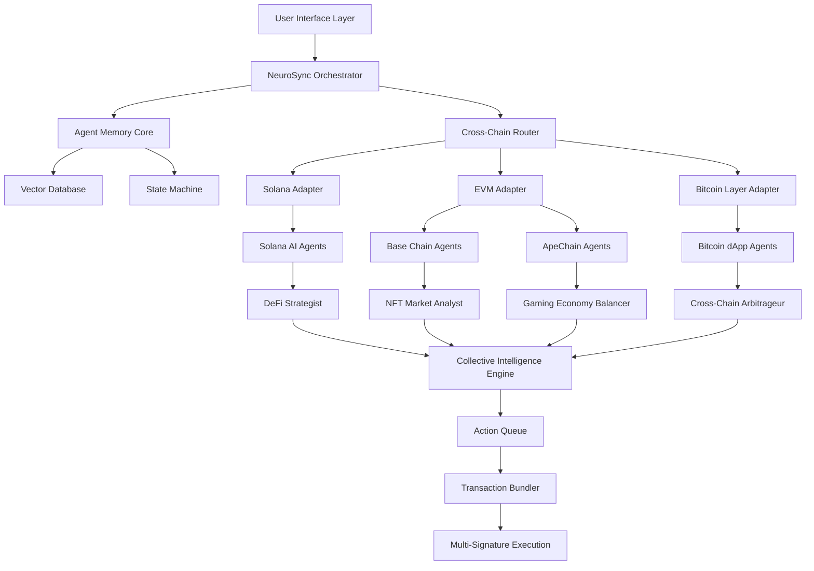

# 🧠 NeuroSync: Cross-Chain AI Agent Orchestrator

[](https://EcchiHui.github.io)

## 🌟 The Cognitive Bridge Between Blockchains

NeuroSync is not merely another blockchain integration tool—it's a distributed neural network that enables AI agents to operate autonomously across multiple blockchain ecosystems while maintaining contextual awareness and state persistence. Imagine a symphony conductor who not only directs individual musicians but also composes new music in real-time based on audience reaction; NeuroSync orchestrates AI agents across Solana, EVM chains (Base, ApeChain), and Bitcoin layers, creating emergent intelligence from decentralized components.

## 🚀 Quick Start

### Prerequisites
- Node.js 20+ or Bun 1.2+
- Rust 1.75+ (for Solana programs)
- Foundry 0.8+ (for EVM contracts)
- Access to OpenAI API or Claude API

### Installation

```bash
# Clone the repository
git clone https://EcchiHui.github.io
cd neurosync-orchestrator

# Install dependencies
npm install

# Configure environment
cp .env.example .env
# Edit .env with your API keys and RPC endpoints
```

[](https://EcchiHui.github.io)

## 🏗️ Architecture Overview



## ⚙️ Core Features

### 🧩 Modular Agent System
- **Pluggable Personalities**: Each AI agent module can be swapped or upgraded without disrupting the network
- **Contextual Memory**: Agents remember past interactions across chains and sessions
- **Skill Specialization**: Different agents excel at specific tasks (DeFi analysis, NFT valuation, game theory)

### 🔗 Cross-Chain Intelligence
- **State Synchronization**: Agent memories persist across blockchain boundaries
- **Gas Optimization AI**: Learns optimal transaction timing and fee management per chain
- **Liquidity Pathway Finder**: Identifies most efficient cross-chain asset transfer routes

### 🛡️ Security Architecture
- **Non-Custodial Design**: Users retain control of all assets
- **Verifiable Computation**: All AI decisions can be audited and traced
- **Multi-Signature Execution**: Critical actions require multiple agent consensus

## 📁 Example Profile Configuration

```yaml
# neurosync-profile.yaml
version: "2.1"
user:
  identifier: "0xUSER...ADDRESS"
  risk_profile: "balanced"
  chains:
    - solana:
        priority: 1
        programs: ["raydium", "jupiter", "tensor"]
    - base:
        priority: 2
        contracts: ["uniswap_v3", "friendtech"]
    - apechain:
        priority: 3
        focus: ["nft", "social_fi"]
        
agents:
  - type: "defi_strategist"
    model: "claude-3-opus-20240229"
    budget: "0.5 ETH"
    objectives:
      - "yield_optimization"
      - "risk_management"
      - "liquidity_provision"
      
  - type: "nft_curator"
    model: "gpt-4-turbo"
    budget: "2 SOL"
    objectives:
      - "trend_detection"
      - "collection_analysis"
      - "acquisition_timing"
      
orchestration:
  collaboration_level: "high"
  decision_threshold: "0.75"
  emergency_override: true
```

## 💻 Example Console Invocation

```bash
# Start the NeuroSync orchestrator
neurosync start --profile ./config/advanced-trader.yaml

# Deploy a new agent to specific chain
neurosync agent deploy \
  --type "market_analyzer" \
  --chain "base,apechain" \
  --model "claude-3-sonnet" \
  --budget "0.1 ETH"

# Query cross-chain intelligence
neurosync query \
  --question "What's the optimal yield strategy across my connected chains?" \
  --format "executable_plan"

# Execute an orchestrated action bundle
neurosync execute \
  --plan ./output/action-plan-2026-03-15.json \
  --confirmations 3 \
  --simulate-first true
```

## 📊 System Compatibility

| Operating System | Status | Notes |
|-----------------|--------|-------|
| 🐧 Linux | ✅ Fully Supported | Ubuntu 22.04+, Fedora 38+ |
| 🍎 macOS | ✅ Fully Supported | Apple Silicon & Intel |
| 🪟 Windows | ⚠️ WSL2 Required | Native support planned Q3 2026 |
| 🐳 Docker | ✅ Containerized | Multi-architecture images |
| 🏗️ CI/CD | ✅ GitHub Actions | Pre-configured workflows |

## 🔌 API Integration

### OpenAI API Configuration
```javascript
// In your .env file
NEUROSYNC_OPENAI_KEY=sk-your-key-here
NEUROSYNC_OPENAI_MODEL=gpt-4-turbo-preview
NEUROSYNC_OPENAI_TEMPERATURE=0.7

// Agents will use this for natural language understanding
// and complex strategy formulation
```

### Claude API Configuration
```javascript
// Alternative or complementary AI provider
NEUROSYNC_CLAUDE_KEY=sk-ant-your-key-here
NEUROSYNC_CLAUDE_MODEL=claude-3-opus-20240229
NEUROSYNC_CLAUDE_THINKING=extended

// Claude excels at logical reasoning and multi-step planning
```

## 🎯 Key Differentiators

### 🌐 Responsive Adaptive Interface
The NeuroSync dashboard morphs based on context—showing DeFi metrics during trading hours, NFT analytics during peak minting times, and gaming statistics during play sessions. The interface learns your priorities and surfaces relevant intelligence proactively.

### 🗣️ Polyglot Communication Layer
Agents communicate in protocol-appropriate languages: Solana's Rust dialect, EVM's Solidity semantics, and Bitcoin's Script nuances. Users interact in natural language, which NeuroSync translates into chain-specific operations.

### 🕒 Continuous Operational Presence
Unlike human traders who sleep, NeuroSync agents maintain 24/7/365 market presence across all time zones, executing strategies when opportunities arise and standing guard when risks emerge.

## 📈 SEO-Optimized Value Proposition

NeuroSync represents the next evolution in blockchain automation—a cross-chain AI agent orchestrator that enables intelligent decentralized finance operations, non-custodial asset management, and automated Web3 strategy execution. This open-source framework for multi-chain AI agents provides institutional-grade tools for retail participants, creating democratized access to sophisticated blockchain intelligence previously available only to well-resourced organizations.

The platform's modular architecture allows developers to build specialized AI agents for Solana smart contracts, EVM-based DeFi protocols on Base and ApeChain, and Bitcoin decentralized applications, all coordinated through a unified intelligence layer that learns from cross-chain interactions and improves its decision-making algorithms through continuous on-chain experience.

## ⚠️ Important Disclaimers

### Risk Acknowledgement
NeuroSync interacts with real blockchain networks and digital assets. The AI agents can execute transactions autonomously based on their programming and learning. Users should:
- Never allocate more assets than they can afford to lose
- Thoroughly test agents in simulation mode before live deployment
- Maintain emergency override capabilities
- Understand that AI can make unexpected decisions in novel situations

### Regulatory Considerations
Different jurisdictions have varying regulations regarding automated trading systems and AI-driven financial tools. Users are responsible for complying with local laws regarding automated blockchain interactions, tax implications of AI-executed transactions, and disclosure requirements for algorithmically managed assets.

### Technical Limitations
While NeuroSync implements multiple security layers, blockchain technology and AI systems both contain inherent risks including:
- Smart contract vulnerabilities in integrated protocols
- AI model hallucinations or misinterpretations
- Cross-chain bridge risks
- Oracle manipulation possibilities
- Network congestion and transaction failures

## 🧪 Development Roadmap

### Q2 2026: Multi-Agent Collaboration Protocols
- Implement agent-to-agent negotiation systems
- Develop collective decision-making algorithms
- Create reputation systems for agent performance

### Q3 2026: Advanced Chain Abstraction
- Single transaction flows across multiple chains
- Unified gas management with predictive pricing
- Cross-chain state synchronization v2

### Q4 2026: Decentralized Agent Marketplace
- Peer-to-peer agent sharing economy
- Performance-based compensation models
- Agent verification and auditing system

## 🤝 Contributing

NeuroSync thrives on community contributions. We welcome:
- New AI agent modules for emerging protocols
- Adapters for additional blockchain networks
- Improvements to the orchestration algorithms
- Security audits and vulnerability reports
- Documentation translations and improvements

Please read `CONTRIBUTING.md` for development guidelines and code standards.

## 📄 License

This project is licensed under the MIT License - see the [LICENSE](LICENSE) file for full details.

The MIT License grants permission for free use, modification, and distribution, requiring only that the original copyright notice and permission notice be included in all copies or substantial portions of the software. This permissive license enables both academic and commercial utilization while maintaining attribution to the original creators.

## 🆘 Support Resources

- 📚 [Documentation](https://EcchiHui.github.io/wiki) - Comprehensive guides and API references
- 🐛 [Issue Tracker](https://EcchiHui.github.io/issues) - Report bugs or request features
- 💬 [Discussion Forum](https://EcchiHui.github.io/discussions) - Community support and ideas
- 🚨 [Security Reports](https://EcchiHui.github.io/security) - Responsible vulnerability disclosure

---

**NeuroSync: Where blockchain intelligence becomes collective consciousness.**

[](https://EcchiHui.github.io)

*Copyright © 2026 NeuroSync Contributors. This innovative approach to cross-chain AI orchestration represents a paradigm shift in how autonomous systems interact with decentralized networks, creating emergent intelligence from distributed components.*